<div align="center">

<br><br>

<a href="https://github.com/ishandutta2007/Awesome-Awesome-Awesome"></a><a href="https://discord.gg/jc4xtF58Ve"></a> <a href="https://github.com/ishandutta2007/Awesome-Coworking-Management/stargazers"></a> <a href="https://github.com/ishandutta2007/Awesome-Coworking-Management/network/members"></a> <a href="https://github.com/ishandutta2007/Awesome-Coworking-Management/blob/main/LICENSE"></a> <a href="https://github.com/ishandutta2007"></a>

# 🏢 Awesome-Coworking-Management

</div>

## 🌐 Top Coworking Management Tools & Flexible Workspace Ecosystem

**A Curated List of SaaS Products & Open-Source GitHub Projects**

*Focused on Membership Management, Desk & Meeting Room Booking, Recurring Billing, IoT Access Control, Visitor Check-in, Community Portals & Space Operations.*

**📅 Last updated: August 2026**

---

### 📖 Introduction & Overview

This repository tracks notable **commercial SaaS platforms** and **open-source projects** for **Coworking Management**, **Flexible Workspaces**, and **Hybrid Office Operations**. Whether you manage an independent boutique coworking space, a multi-location enterprise flex network, an academic incubator, a maker studio, or an enterprise hybrid desk pool, these tools streamline:

- 📅 **Desk & Room Reservation**: Visual floor plans, hot-desking, dedicated desks, meeting rooms, call booths, and hourly resource scheduling.
- 💳 **Membership & Invoicing**: Tiered subscriptions, recurring billing, automated payment gateway integration, credit allocations, and add-on charges.
- 🔒 **Access Control & IoT**: Cloud-managed door locks, turnstiles, RFID/NFC keycards, mobile Bluetooth passes, and automated WiFi provisioning.
- 👥 **Community & Member Experience**: Whitelabel member iOS/Android apps, member directories, feed announcements, event ticketing, and internal helpdesks.
- 📊 **Utilization & Analytics**: Real-time sensor-based occupancy tracking, churn analytics, revenue forecasting, and tax/accounting exports.

---

## 📑 Table of Contents

- [🏢 SaaS/Hosted Platforms](#-saashosted-platforms)
- [💻 Open-Source GitHub Projects](#-open-source-github-projects)
- [🧩 Flexible Workspace Tech Stack Architecture](#-flexible-workspace-tech-stack-architecture)
- [🛠️ Additional Open-Source Building Blocks](#️-additional-open-source-building-blocks)
- [🤝 How to Contribute](#-how-to-contribute)
- [📈 Star History](#-star-history)
- [⚖️ Disclaimer](#️-disclaimer)

---

## 🏢 SaaS/Hosted Platforms

The table below catalogs leading commercial coworking management suites, sorted by **estimated company size / valuation / annual revenue** (descending).

| Platform | Description & Key Features | Est. Valuation / Revenue | Starting Price | Free Tier / Free Trial Limits |
| :--- | :--- | :--- | :--- | :--- |
| **[Yardi Kube](https://www.yardikube.com/)** | Enterprise-grade flexible workspace and coworking management suite within the Yardi real estate ecosystem, delivering end-to-end accounting, operations, booking portals, WiFi management, and multi-property reporting. | **~$1.8B** *(Annual Revenue)* | **$349 / site / month** *(Yardi Kube Start plan for single-site operators; custom enterprise quotes for large portfolios)* | **No free tier or free trial** *(Provides personalized interactive live product demonstrations and architecture reviews upon request).* |
| **[Nexudus](https://www.nexudus.com/)** | Global category leader in white-label coworking and flex space management, featuring automated recurring billing, interactive floor plans, CRM, access control, and extensive multi-location capabilities. | **~$31M** *(Annual Revenue / Bootstrapped)* | **$150 / month** *(Base fee for up to 50 active users; dynamically scales with active monthly member volume)* | **21-day free trial** *(Full access to core platform features and settings; requires payment details or cancellation notice prior to expiration).* |
| **[Essensys](https://essensys.tech/)** | Enterprise software and digital infrastructure platform tailored for flex space operators and commercial landlords, orchestrating workspace operations, automated WiFi provisioning, and IoT access. | **~£19.2M (~$25M)** *(Annual Revenue, LSE: ESYS)* | **~£1,200 / month** *(~$1,500/mo enterprise base pricing customized based on square footage, sites, and IT infrastructure)* | **No free tier or free trial** *(Requires enterprise IT integration; scheduled live technical demonstrations available upon request).* |
| **[OfficeRnD](https://www.officernd.com/)** | Widely adopted all-in-one platform for coworking operators and hybrid offices, offering member management, resource booking, automated invoicing, analytics, and rich CRM integrations. | **~$22M** *(ARR / $17.4M Total Funding)* | **$165 / month** *(Billed annually, or $185/mo billed monthly for Flex; Workplace hybrid edition starts at $99/mo for up to 150 users)* | **14-day free trial** *(Workplace plan offers 14-day full feature trial, extendable by 7 days upon request; Flex edition offers interactive demos).* |
| **[Optix](https://www.optixapp.com/)** | Mobile-first workspace management platform with custom-branded iOS/Android member apps, instant desk/room booking, workflow automation, and multi-location networking. | **~$5.3M** *(ARR / $15M Total Funding)* | **$159 / month** *(Essentials tier for up to 50 active users; Pro starts at $239/mo for up to 100 users with white-labeled app)* | **14-day free trial** *(Full access to test mobile booking workflows and member management; no credit card required).* |
| **[Cobot](https://www.cobot.me/)** | Veteran independent coworking software designed for simplicity and reliability, focusing on automated billing, time-pass management, resource booking, and multi-language support. | **~$4.0M** *(Est. ARR / Bootstrapped)* | **$59 / month** *(Or €59/mo for up to 15 active members; scales upward predictably per active member tier)* | **30-day free trial** *(Unrestricted full access to all features, no credit card required; indefinite trial extension available for spaces not yet opened).* |
| **[Archie](https://archieapp.co/)** | Modern coworking management software featuring contactless check-in, meeting room and desk reservations, member directory, community feed, and automated invoicing. | **~$2.8M** *(ARR / $8.5M Total Funding)* | **$165 / location / month** *(Billed annually, or $192/mo billed monthly on Starter plan)* | **14-day free trial** *(Full feature sandbox access to test workspace scheduling and member management via demo onboarding).* |
| **[Spacebring](https://www.spacebring.com/)** | Mobile-first coworking platform *(formerly andcards)* with seamless member apps, auto-invoicing, digital key integrations, and community feeds. | **~$2.4M** *(ARR / Bootstrapped)* | **€158 / month** *(~$175/mo base Business plan; modular add-ons available for branded mobile apps and visitor management)* | **7-day free trial** *(Full access to Business tier features configured via a personalized 1-on-1 setup session; no credit card required).* |
| **[Coworks](https://www.coworks.com/)** | Modern, mobile-first workspace management software designed specifically for universities, incubators, innovation hubs, and community coworking spaces. | **~$2.0M** *(Est. ARR / $1.94M Total Funding)* | **$149 / month** *(Billed annually, or $199/mo billed monthly for up to 150 members on Hybrid Workspace plan)* | **No free tier or free trial** *(Free personalized live product demonstration and onboarding assessment provided upon booking).* |
| **[Zapfloor](https://www.zapfloor.com/)** | Modular flex workspace and business center management software with integrated contract workflows, ticketing, resource booking, and automated invoicing. | **~$1.5M** *(ARR / $3.2M Total Funding)* | **$99 / month** *(Launch tier for small/medium business centers; custom pricing for Growth and Enterprise tiers)* | **No free tier or free trial** *(Interactive 15-minute live personalized demo and consultation provided upon request).* |
| **[Proximity Space](https://www.proximity.space/)** | Coworking management platform with deep focus on digital door access hardware integration *(Proximity Open)*, space utilization, and automated member billing. | **~$1.0M** *(Est. ARR / $540K Total Funding)* | **$189 / month** *(For up to 40 active members; +$99/mo per location for digital door access hardware integration)* | **14-day free trial** *(Full access to administrative dashboard, member portal, and booking tools; no credit card required).* |
| **[Satellite Deskworks](https://www.satellitedeskworks.com/)** | Robust coworking and shared workspace management system built by operators for operators, featuring automated billing, network check-in, and desk/room reservation. | **~$1.0M** *(Est. ARR / Independent)* | **$65 / month** *(Base tier for up to 15 members; flat-rate standard packages start at $125/mo)* | **No free tier or free trial** *(Provides scheduled personalized live product demonstration and workflow consultation).* |
| **[Coworkify](https://coworkify.com/)** | Lightweight, minimalist coworking management software focused on member management, booking calendars, and recurring billing. | **~$500K** *(Est. ARR / Bootstrapped)* | **$29 / month** *(Starter tier for small coworking spaces and community hubs)* | **30-day free trial** *(Full access to create unlimited spaces and test all features; no credit card required; auto-expires if not upgraded).* |

---

## 💻 Open-Source GitHub Projects

Self-hosted desk booking systems, meeting room schedulers, and workspace management platforms. **Sorted strictly by GitHub Star count (descending)**:

- **[Cal.com](https://github.com/calcom/cal.com)** [](https://github.com/calcom/cal.com/stargazers)  
  ⚡ *Category*: Scheduling Infrastructure & Resource Reservation  
  The open-source scheduling infrastructure and reservation platform. Widely integrated into custom coworking and flex-space portals for booking meeting rooms, private desks, event tours, podcast studios, and member onboarding sessions with calendar sync.

- **[Easy!Appointments](https://github.com/alextselegidis/easyappointments)** [](https://github.com/alextselegidis/easyappointments/stargazers)  
  📅 *Category*: Appointment & Resource Booking Engine  
  Extensible open-source appointment and resource booking system with Google/Outlook calendar synchronization, multi-attendant support, customizable booking rules, and REST API for spaces and rooms.

- **[LibreBooking](https://github.com/LibreBooking/librebooking)** [](https://github.com/LibreBooking/librebooking/stargazers)  
  🕒 *Category*: Resource & Facility Reservation System  
  Community fork of phpScheduleIt / Booked Scheduler. An open-source resource scheduling system used globally for reserving meeting rooms, hot-desks, shared maker equipment, lab benches, and multi-tenant flex facilities.

- **[Seatsurfing](https://github.com/seatsurfing/seatsurfing)** [](https://github.com/seatsurfing/seatsurfing/stargazers)  
  🪑 *Category*: Desk Sharing & Room Reservation  
  Open-source desk sharing, room reservation, free seating, and coworking platform built in Go. Includes a performant backend, a mobile-optimized Progressive Web App (PWA) booking UI, and an administrative control panel for interactive floor maps.

- **[OpenReservation](https://github.com/OpenReservation/OpenReservation)** [](https://github.com/OpenReservation/OpenReservation/stargazers)  
  ⚙️ *Category*: Modular Space Booking Engine  
  Modular open-source reservation engine built on ASP.NET Core for managing physical spaces, activity centers, shared meeting rooms, and venue reservations with rule-based permissions.

- **[classroombookings](https://github.com/classroombookings/classroombookings)** [](https://github.com/classroombookings/classroombookings/stargazers)  
  🏫 *Category*: Timetable Grid & Room Scheduler  
  Open-source room and resource booking management system featuring visual timetable grids, recurring reservation rules, multi-building management, and role-based access control.

- **[Effective Office](https://github.com/effective-dev-opensource/Effective-Office)** [](https://github.com/effective-dev-opensource/Effective-Office/stargazers)  
  🏢 *Category*: Office Automation & Display System  
  Open-source office automation suite covering meeting room reservations, interactive workspace dashboard displays, workplace asset tracking, and smart room tablet integration.

- **[MRBS (Meeting Room Booking System)](https://github.com/meeting-room-booking-system/mrbs-code)** [](https://github.com/meeting-room-booking-system/mrbs-code/stargazers)  
  📆 *Category*: Multi-Room Reservation Matrix  
  Time-tested open-source multi-room booking system with visual day/week/month calendar matrices, conflict handling, recurring bookings, LDAP/SAML authentication, and flexible resource categorization.

- **[WARP (Workspace Autonomous Reservation Program)](https://github.com/sebo-b/warp)** [](https://github.com/sebo-b/warp/stargazers)  
  🗺️ *Category*: Visual Desk & Seating Map  
  Open-source (MIT) system for managing hybrid office space, hot-desks, and assigned seating. Features visual floor plan booking, mobile/PWA support, utilization reporting, and administrative tools for zones, desks, and users.

- **[Respa](https://github.com/City-of-Helsinki/respa)** [](https://github.com/City-of-Helsinki/respa/stargazers)  
  🏛️ *Category*: Public & Shared Space Reservation API  
  Open-source resource reservation and space management API (Django/Python) built to manage physical venues, meeting rooms, shared equipment, and public work hubs at city scale.

- **[Roomer](https://github.com/c0dewhacker/Roomer)** [](https://github.com/c0dewhacker/Roomer/stargazers)  
  📍 *Category*: Interactive Floor Plan & Desk Booking  
  Self-hosted React/TypeScript space management platform supporting custom SVG floor plan uploads, desk reservations, and workspace asset tracking.

- **[GreenCoworkingHub](https://github.com/Ivon1/GreenCoworkingHub)** [](https://github.com/Ivon1/GreenCoworkingHub/stargazers)  
  🌱 *Category*: Full-Stack Coworking Booking App  
  Full-stack coworking space booking application (.NET Core & Angular) featuring smart reservation workflows, resource management, and conflict prevention.

- **[Coworking Booking](https://github.com/yujisoyama/coworkingbooking)** [](https://github.com/yujisoyama/coworkingbooking/stargazers)  
  🐳 *Category*: Dockerized Coworking Reservation Prototype  
  Dockerized open-source coworking reservation application designed for booking hot-desks, dedicated tables, and meeting rooms.

- **[Bookyp](https://github.com/geprog/bookyp)** [](https://github.com/geprog/bookyp/stargazers)  
  📦 *Category*: Workspace Inventory & Room Reservation  
  Open-source platform for managing and booking rooms and flexible workspaces with focus on space inventory and reservation workflows.

---

## 🧩 Flexible Workspace Tech Stack Architecture

A modern, highly autonomous coworking or hybrid workspace typically combines layers across software, hardware, and community operations:

```
┌────────────────────────────────────────────────────────────────────────┐
│                        MEMBER EXPERIENCE LAYER                         │
│   • Whitelabel iOS/Android App (Optix, Spacebring, Custom PWA)        │
│   • Booking Web Portal (Cal.com, Seatsurfing, LibreBooking)            │
│   • Meeting Room Displays & Kiosk Tablets (Effective Office, MRBS)    │
└───────────────────────────────────┬────────────────────────────────────┘
                                    │
┌───────────────────────────────────▼────────────────────────────────────┐
│                      CORE OPERATIONS & BILLING                         │
│   • Membership Tiers, Automated Invoicing & Stripe Integration        │
│   • CRM, Leads, Contract Lifecycle & Deposit Tracking                  │
│   • Resource Availability Engine & Conflict Detection                  │
└───────────────────────────────────┬────────────────────────────────────┘
                                    │
┌───────────────────────────────────▼────────────────────────────────────┐
│                      PHYSICAL IOT & ACCESS CONTROL                     │
│   • Cloud Access Control (Brivo, Kisi, SALTO, Proximity Open, Seam)   │
│   • Smart Lockers, Turnstiles & Intercom Doors                         │
│   • Network / RADIUS WiFi Provisioning (Cisco Meraki, UniFi, Mikrotik) │
│   • Presence Sensors & Real-time Desk Occupancy Heatmaps               │
└────────────────────────────────────────────────────────────────────────┘
```

---

## 🛠️ Additional Open-Source Building Blocks

Many operators build robust, privacy-first coworking tech stacks by integrating specialized open-source tools:

- 💳 **Billing & Invoicing**: Combine open-source billing engines (like [Kill Bill](https://github.com/killbill/killbill) or [Invoice Ninja](https://github.com/invoiceninja/invoiceninja)) with Stripe/GoCardless webhooks.
- 🔐 **Authentication & Single Sign-On (SSO)**: Deploy [Keycloak](https://github.com/keycloak/keycloak) or [Authentik](https://github.com/go-authentik/authentik) for unified member login across WiFi, door access, and booking portals.
- 📶 **Network & WiFi Gateway Provisioning**: Use RADIUS authentication integrated with [FreeRADIUS](https://github.com/FreeRADIUS/freeradius-server) to provision unique WiFi passkeys per active member.
- 🔒 **IoT Hardware Integration**: Bridge smart physical relays, door strikes, and presence sensors via [Home Assistant](https://github.com/home-assistant/core) or [OpenRemote](https://github.com/openremote/openremote).
- 💬 **Member Community & Internal Chat**: Host private member communication spaces using [Matrix / Element](https://github.com/element-hq/element-web) or [Discourse](https://github.com/discourse/discourse).

---

## 🤝 How to Contribute

Contributions to this ecosystem list are warmly welcomed!

1. 🍴 **Fork the repository** on GitHub.
2. ✍️ **Add or edit entries** in `README.md` following the existing tabular or open-source list format.
3. 📝 **Include**: Name, official URL / GitHub repo, concise description, specific starting price / star badge, and free tier / trial limits.
4. 🚀 **Submit a Pull Request** with a brief summary of the addition or correction.

⭐ **Star the repo** if you find it helpful for your space operations!

---

## 📈 Star History

[](https://star-history.dera.page/#ishandutta2007/Awesome-Coworking-Management&type=date&legend=top-left)

---

## ⚖️ Disclaimer

- This is a **community-curated index** for educational and informational purposes — not a commercial endorsement.
- Coworking operators should evaluate tools based on membership model flexibility, booking reliability, gateway transaction fees, door hardware compatibility, multi-location scaling, and total cost of ownership (including self-hosting overhead).
- Platform pricing and feature tiers are subject to change by respective vendors.

---

<div align="center">
  <sub>Made with ❤️ for coworking operators, flexible workspace managers, hybrid office leads, and open-source advocates worldwide.</sub>
</div>
